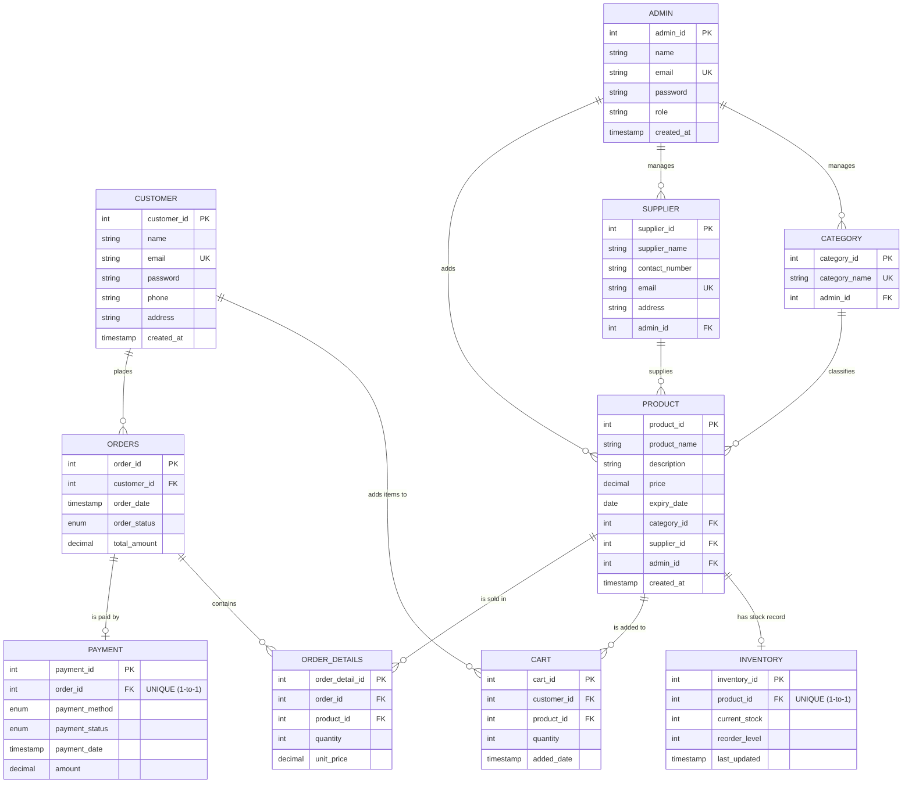

# SmartMart — Entity-Relationship Diagram

The diagram below is written in [Mermaid](https://mermaid.js.org/). It renders automatically on GitHub.
In VS Code, install the **Markdown Preview Mermaid Support** extension, or paste the code block into
[mermaid.live](https://mermaid.live) to view or export it as an image for the report.

**Legend:** `PK` primary key · `FK` foreign key · `UK` unique key

---

## 1. Entities

| # | Table | Primary key | Purpose |
|---|-------|-------------|---------|
| 1 | `admin` | `admin_id` | Store staff / managers who maintain the catalogue |
| 2 | `customer` | `customer_id` | Registered shoppers |
| 3 | `category` | `category_id` | Product groupings (Dairy & Bakery, Beverages, …) |
| 4 | `supplier` | `supplier_id` | Vendors that supply products |
| 5 | `product` | `product_id` | Items sold in the store |
| 6 | `inventory` | `inventory_id` | Current stock and reorder threshold per product |
| 7 | `cart` | `cart_id` | Items a customer has added but not yet ordered |
| 8 | `orders` | `order_id` | One row per placed order |
| 9 | `order_details` | `order_detail_id` | One row per product line on an order |
| 10 | `payment` | `payment_id` | Payment record for an order |

Plus 3 views built on these tables: `product_inventory_view`, `customer_order_history_view`,
`product_sales_report_view` (defined in `advanced_queries.sql`).

---

## 2. Relationships and cardinality

| Parent (1) | Child (many) | Cardinality | FK column | ON DELETE | Why |
|------------|--------------|-------------|-----------|-----------|-----|
| `admin` | `category` | 1 : N | `category.admin_id` | SET NULL | Deleting an admin must not delete the catalogue |
| `admin` | `supplier` | 1 : N | `supplier.admin_id` | SET NULL | Same |
| `admin` | `product` | 1 : N | `product.admin_id` | SET NULL | Same |
| `category` | `product` | 1 : N | `product.category_id` | RESTRICT | Can't delete a category that still has products |
| `supplier` | `product` | 1 : N | `product.supplier_id` | RESTRICT | Can't delete a supplier that still supplies products |
| `product` | `inventory` | **1 : 1** | `inventory.product_id` (UNIQUE) | CASCADE | Stock record has no meaning without its product |
| `customer` | `cart` | 1 : N | `cart.customer_id` | CASCADE | Removing a customer clears their cart |
| `product` | `cart` | 1 : N | `cart.product_id` | CASCADE | Removing a product removes it from carts |
| `customer` | `orders` | 1 : N | `orders.customer_id` | RESTRICT | Order history must be preserved |
| `orders` | `order_details` | 1 : N | `order_details.order_id` | CASCADE | Line items belong to the order |
| `product` | `order_details` | 1 : N | `order_details.product_id` | RESTRICT | Can't delete a product that appears on past invoices |
| `orders` | `payment` | **1 : 1** | `payment.order_id` (UNIQUE) | CASCADE | One payment record per order |

### Many-to-many relationships resolved with junction tables

| M : N relationship | Junction table | Extra attributes stored on the relationship |
|--------------------|----------------|---------------------------------------------|
| `orders` ↔ `product` | `order_details` | `quantity`, `unit_price` |
| `customer` ↔ `product` | `cart` | `quantity`, `added_date` |

`cart` has a composite `UNIQUE (customer_id, product_id)` so a product appears at most once per customer's cart
(adding it again should update the quantity).

---

## 3. Notes on how the diagram maps to the schema

- **Optional vs mandatory participation.** `product.category_id` and `product.supplier_id` are `NOT NULL`, so every
  product must belong to a category and a supplier. The `admin_id` columns are nullable, so an admin link is optional.
- **`ORDERS ||--o{ ORDER_DETAILS`.** Business rule: an order should have at least one line. The database does not
  enforce this (it would need a trigger or application logic); the application always inserts at least one line.
- **1-to-1 relationships** are implemented by putting a `UNIQUE` constraint on the foreign key
  (`inventory.product_id`, `payment.order_id`).
- **Enums.** `order_status` (Pending, Confirmed, Shipped, Delivered, Cancelled), `payment_method` (Cash, Card, UPI,
  NetBanking, Wallet) and `payment_status` (Pending, Completed, Failed, Refunded) are PostgreSQL enum types.

Source of truth for all of the above: [`schema.ts`](../schema.ts).